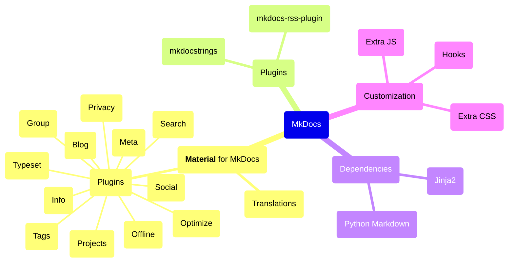

# Introduction

Material for MkDocs is based on [MkDocs], a static site generator. Originally
conceived as a theme for MkDocs that took inspiration from Google's Material
Design, it has since grown to become a comprehensive solution for developing
technical documentation as well as other web content.

When starting to use Material for MkDocs, it is useful to first gain a 30,000ft
overview in order to understand how MkDocs and Material for MkDocs work together
and how you can also draw on a right pool of some 240 [plugins].

[plugins]: https://github.com/mkdocs/catalog

